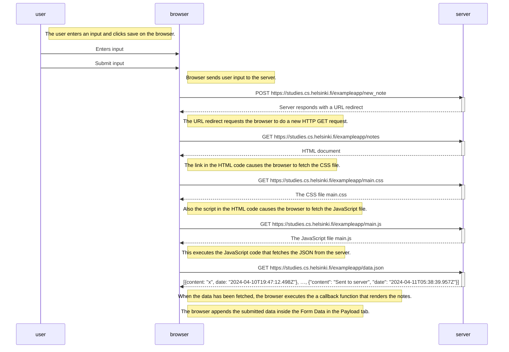

```mermaid

sequenceDiagram
    participant user
    participant browser
    participant server

    Note right of user: The user enters an input and clicks save on the browser.

    user->>browser: Enters input
    user->>browser: Submit input

    Note right of browser: Browser sends user input to the server.

    browser->>server: POST https://studies.cs.helsinki.fi/exampleapp/new_note
    activate server
    server-->>browser: Server responds with a URL redirect
    deactivate server

    Note right of browser: The URL redirect requests the browser to do a new HTTP GET request.

    browser->>server: GET https://studies.cs.helsinki.fi/exampleapp/notes
    activate server
    server-->>browser: HTML document
    deactivate server

    Note right of browser: The link in the HTML code causes the browser to fetch the CSS file.

    browser->>server: GET https://studies.cs.helsinki.fi/exampleapp/main.css
    activate server
    server-->>browser: The CSS file main.css
    deactivate server

    Note right of browser: Also the script in the HTML code causes the browser to fetch the JavaScript file.

    browser->>server: GET https://studies.cs.helsinki.fi/exampleapp/main.js
    activate server
    server-->>browser: The JavaScript file main.js
    deactivate server

    Note right of browser: This executes the JavaScript code that fetches the JSON from the server.

    browser->>server: GET https://studies.cs.helsinki.fi/exampleapp/data.json
    activate server
    server-->>browser: [{content: "x", date: "2024-04-10T19:47:12.498Z"}, …, {"content": "Sent to server", "date": "2024-04-11T05:38:39.957Z"}]
    deactivate server

    Note right of browser: When the data has been fetched, the browser executes the a callback function that renders the notes.

    Note right of browser: The browser appends the submitted data inside the Form Data in the Payload tab.

```
	