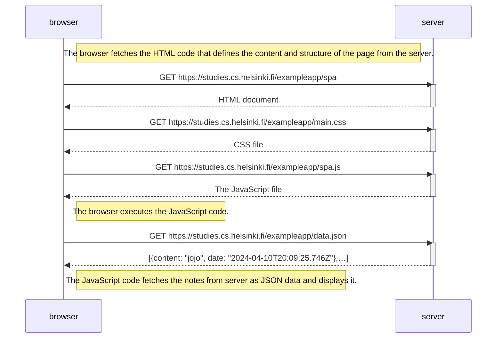

```mermaid
sequenceDiagram
  participant browser
  participant server

  Note right of browser: The browser fetches the HTML code that defines the content and structure of the page from the server.

  browser->>server: GET https://studies.cs.helsinki.fi/exampleapp/spa
  activate server
  server-->>browser: HTML document
  deactivate server

  browser->>server: GET https://studies.cs.helsinki.fi/exampleapp/main.css
  activate server
  server-->>browser: CSS file
  deactivate server

  browser->>server: GET https://studies.cs.helsinki.fi/exampleapp/spa.js
  activate server
  server-->>browser: The JavaScript file
  deactivate server

  Note right of browser: The browser executes the JavaScript code.

  browser->>server: GET https://studies.cs.helsinki.fi/exampleapp/data.json
  activate server
  server-->>browser: [{content: "jojo", date: "2024-04-10T20:09:25.746Z"},…]
  deactivate server

  Note right of browser: The JavaScript code fetches the notes from server as JSON data and displays it.
```