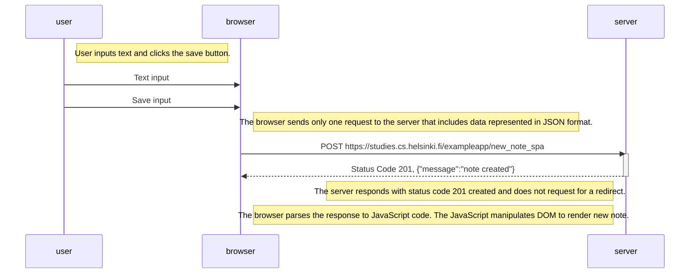

```mermaid

sequenceDiagram
  participant user
  participant browser
  participant server

  Note right of user: User inputs text and clicks the save button.

  user->>browser: Text input
  user->>browser: Save input

  Note right of browser: The browser sends only one request to the server that includes data represented in JSON format.

  browser->>server: POST https://studies.cs.helsinki.fi/exampleapp/new_note_spa
  activate server
  server-->>browser: Status Code 201, {"message":"note created"}
  deactivate server

  Note left of server: The server responds with status code 201 created and does not request for a redirect.

  Note right of browser: The browser parses the response to JavaScript code. The JavaScript manipulates DOM to render new note.
```